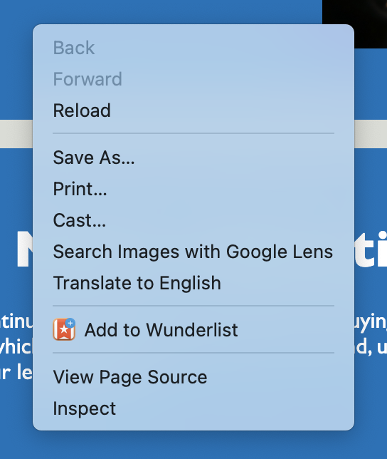

# <Accessibility Challenge>

## Description

This project involved refacorting existing HTML code to make the content more accessible to those with a disablity. Using semantic HTML elements, ensuring the code is structured logically, and including alt text to describe images helps those with vision impairments access this webpage and understand the content. Completing this project helped me learn how individuals with vision impairments get information from websites and it also helped me practice writing cleaner looking code.  

## Installation

N/A

## Usage

The webpage provides an overview of Horiseon's marketing offerings. To view the accessibility features, right click on the page and select 'View Page Source'.

## Credits

N/A

## License

N/A